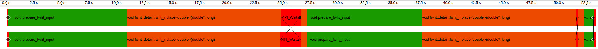

# Performance analysis ("profiling")

My code is too slow! What do I do?

- Find out *where* the slow code segments are
- Figure out *why* it's slow
    - Suboptimal algorithm?
    - Inefficient use of hardware features?
- Focus optimization efforts where it matters!
    - Long function that is only called once vs a short function that is called<br>
    1 000 000 times?

Let's look at common **profiling methods** and **tools** for systematically answering these questions.

# Collecting performance data

- **Sampling:** Periodically interrupt program execution and record where it is
    - Gives a *statistical* performance profile of a program: hot code paths emerge naturally
- **Instrumentation:** Place markers in code, either manually or automatically with tools
    - Markers generate a timestamped **trace** of events during execution
    - Events can record any performance metrics: hardware counters, memory usage, ...
    - Instrumentation can have significant runtime overhead! Leave out from production builds

# Sampling example: Python cProfile

`cProfile` uses sampling to identify functions that take up most of the execution time.

<small>

```
9216685 function calls (9214011 primitive calls) in 83.535 seconds

Ordered by: internal time
List reduced from 1639 to 6 due to restriction <6>

ncalls  tottime  percall  cumtime  percall filename:lineno(function)
    8   19.076    2.384   19.076    2.385 _decomp.py:284(eigh)
    6   14.773    2.462   14.773    2.462 {method 'construct_density' of 'LocalizedFunctionsCollection' objects}
    4   11.353    2.838   11.353    2.838 {method 'calculate_potential_matrices' of 'LocalizedFunctionsCollection'}
    8   10.885    1.361   11.644    1.456 hamiltonian.py:57(_calculate_matrix_without_kinetic)
    30   3.553    0.118    3.553    0.118 {built-in method _gpaw.mmm}
 72005   3.043    0.000    3.043    0.000 {method 'calculate' of 'XCFunctional' objects}
```
</small>

# Instrumentation example: Score-P profile

Score-P is an instrumentation and profiling tool for HPC applications.

<small>

```
    type    max_buf[B]      visits time[s] time[%] time/visit[us]  region
    ALL 3,724,512,664 143,247,790   42.75   100.0           0.30  ALL
    USR 3,724,403,358 143,246,283   40.95    95.8           0.29  USR
 SCOREP            60           2    1.78     4.2      887902.56  SCOREP
    MPI        96,220       1,004    0.01     0.0          12.49  MPI
    COM        13,026         501    0.01     0.0          15.53  COM

    USR     2,184,000      84,000   14.65    34.3         174.43  stbiw__encode_png_line
    USR 2,594,279,454  99,779,979   11.64    27.2           0.12  stbiw__paeth
    USR   728,000,000  28,000,000    3.83     9.0           0.14  cmap
    USR           182           7    3.67     8.6      524131.48  bytes_from_data
    USR   285,944,178  10,997,853    2.43     5.7           0.22  stbiw__zlib_countm
    USR           182           7    2.04     4.8      291795.88  stbi_zlib_compress
    USR        13,000         500    1.83     4.3        3656.15  void evolve(Field&, const Field&, double, double)
 SCOREP            19           1    1.78     4.2     1775756.92  TRACE BUFFER FLUSH
```
</small>


# Trace example

- Markers placed with instrumentation can be used to produce timelines of program execution
- Caution: Tracing long programs can produce enormous output files


<small>*Example traces from two MPI tasks, collected with Score-P*</small>


# Hardware counters

Tracking hardware events give hints about *why* a particular code segment takes as long as it does.

<div style="margin-top: 1em;"></div>

- CPU cycles
- Cache misses
- Memory page faults
- Branch mispredictions
- ...

Profiling tools tailored for HPC usually collect these.

# Profiling tools

There are lots! Some common ones in HPC include:

- [Linux `perf`](https://www.man7.org/linux/man-pages/man1/perf.1.html)
- [AMD μProf](https://www.amd.com/en/developer/uprof.html)
- [Intel VTune](https://www.intel.com/content/www/us/en/developer/tools/oneapi/vtune-profiler.html)
- GPU vendor-specific profilers:
    - [NVIDIA Nsight Systems](https://developer.nvidia.com/nsight-systems)
    - [AMD rocprofiler](https://rocm.docs.amd.com/projects/rocprofiler-sdk/en/latest/how-to/using-rocprofv3.html)
- MPI-aware profiling suites:
    - [Score-P](https://www.vi-hps.org/projects/score-p/overview/overview.html), [Scalasca](https://scalasca.org/) and the rest of their ecosystem
    - [TAU Performance System](https://www.cs.uoregon.edu/research/tau/home.php)

# Demo: tracing with Score-P and Vampir

Profiling the message-chain MPI exercise
