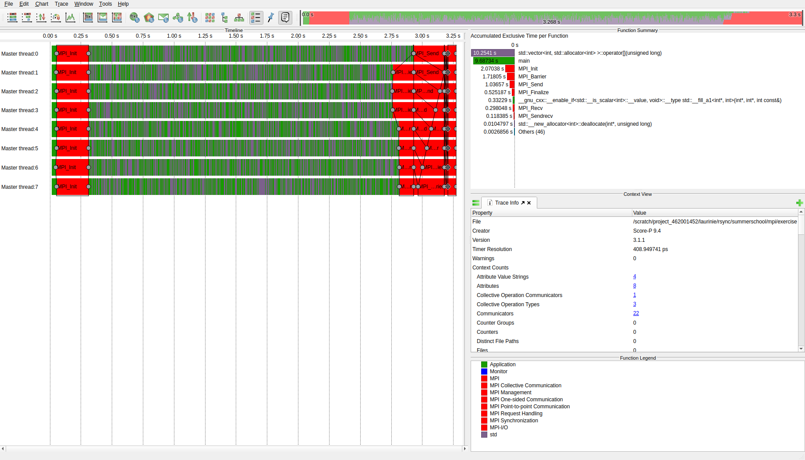
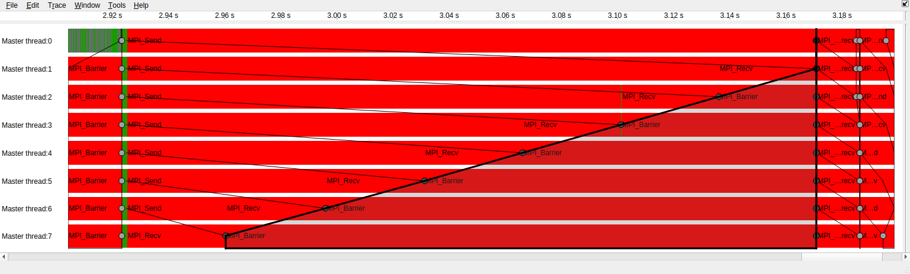
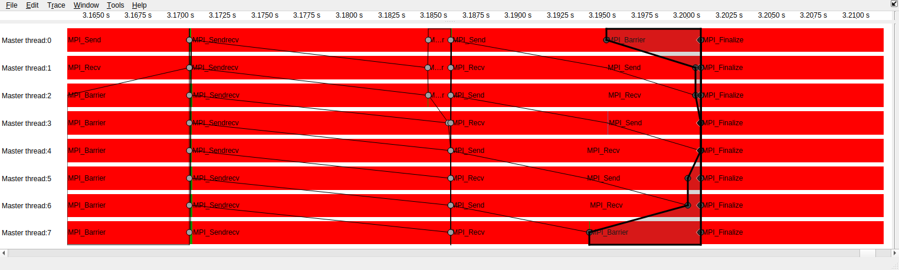

<!--
SPDX-FileCopyrightText: 2026 CSC - IT Center for Science Ltd. <www.csc.fi>

SPDX-License-Identifier: CC-BY-4.0
-->

# Profiling with Score-P

Use the [message-chain exercise](../../../mpi/exercises/05-message-chain/) as an example.
Recall that this exercise implements a message-passing chain:
- Rank 0 sends to rank 1 and receives from no one
- Rank 1 receives from rank 0 and sends to rank 2
- ...
- Last rank n receives from n-1 and sends to no one

The model solution demonstrates three implementations:
- Case A implements this by having every rank send first, wait for the message to arrive at the receiver, then start its own `MPI_Recv`.
- Case B uses `MPI_Sendrecv` to initiate receive operation at the same time as the send operation.
- Case C has even ranks calling `MPI_Send` first and odd ranks calling `MPI_Recv` first.

This demo uses the profiling and instrumentation tool [Score-P](https://www.vi-hps.org/projects/score-p/overview/overview.html) to record traces of the model solution run and shows how to view the traces using an interactive session on LUMI. The traces will clearly show how each chain implementation behaves in terms of MPI wait times.


## Collecting traces with Score-P

This describes LUMI-C only.

Load our installation of Score-P:
```bash
export EBU_USER_PREFIX=/projappl/project_462001452/EasyBuild/
module load LUMI/25.03 partition/C Score-P/9.4-cpeGNU-25.03
```
The [LUMI software library](https://lumi-supercomputer.github.io/LUMI-EasyBuild-docs/s/Score-P/) has build recipes for Score-P if you ever need to build your own installation.

We then compile the exercise solution using a Score-P instrumentation wrapper. This will insert trace markers and other profiling information into the produced executable.
```bash
cd /path/to/message-chain/solution/
scorep CC chain.cpp -o chain_scorep
```

We now run the program as usual, but set some environment variables for configuring runtime behavior of Score-P.
Use the following Slurm job script:
```bash
#!/bin/bash
#SBATCH --account=project_462001452
#SBATCH --partition=small
#SBATCH --reservation=SummerSchoolCPU
#SBATCH --nodes=1
#SBATCH --ntasks-per-node=8

export SCOREP_ENABLE_TRACING=1                    # record and output traces
export SCOREP_TOTAL_MEMORY=1G                     # more memory for Score-P (tracing can be memory hungry)
export SCOREP_EXPERIMENT_DIRECTORY=scorep_output  # Score-P output directory

srun ./chain_scorep
```

You can find Score-P output in the specified output directory (`scorep_output` in this case) once the run finishes.
It contains a "profile" file `profile.cubex` that records how much time was spent in any instrumented function call.
You can view it, for example, using
```bash
scorep-score -r profile.cubex
```
If you are only interested in trace files (below), you could instruct Score-P to omit this profile file altogether by
setting `SCOREP_ENABLE_PROFILING=0` in the environment.

There is also a trace file, `traces.otf2`, and a bunch of auxiliary files related to it. Score-P generates traces in the
Open Trace Format 2 (`.otf2`). This format is part of the Score-P profiling "ecosystem" and requires a specialized trace
viewer with `.otf2` support. The format is not widely used outside of HPC.
We use a tool called [Vampir](https://vampir.eu/) to view it.


## Viewing the trace with Vampir

Caveat: Vampir is a commercial, closed source tool.
There is a license, which allows the usage of Vampir on LUMI.

------------------------------------------------

Go to www.lumi.csc.fi and login.

Start a Desktop session. Reserve 4 cores so that you have enough memory (trace files can get big).

When in the desktop session, open a terminal and type
```bash
module load Vampir
vampir &
```

Open the `.otf2` trace file in Vampir. You should see something similar to the screenshot below:


In the left-hand side window you see traces for each MPI task, labeled as "Master thread:n". We didn't use multithreading in this example so for each task there is just one "master" thread. Vampir and Score-P would support also MPI + multithreaded tracing.

For this example case we are only interested in tracing MPI calls, denoted in Vampir by red blocks. You can see the MPI_Init calls near the start of each trace. Our message chains are near the very end of the trace, and everything in between can be identified as array access operations
as the main function is initializing our input arrays.

There is a "minimap" at top right that you can use to zoom in (mouse scroll on the minimap). Let's navigate to the end where our MPI communication happens and zoom in. We can identify the "case A" chain. The little dots on the trace mark where each task calls MPI_Barrier, ie. is done with its sends and receives. We can clearly see how tasks earlier in the chain have to wait for the full chain to unwind before their `MPI_Send`  can finish.



Zooming in to the next two trace segments show the message chains for implementations B (`MPI_Sendrecv`) and C (alternating send and receive).

